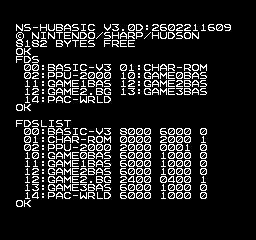
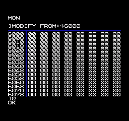
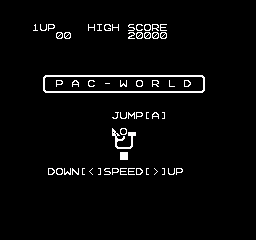

# [WIP] *Family BASIC V3 on Disk System*
https://github.com/NipponNoraneko/FC-DiskBASIC/tree/v3 から分離しました。<br>
今後はこのリポジトリを更新していきます。<br>

最近の更新<BR>
- [テル氏](https://x.com/teru72ig)のPAC-WORLDを同梱<br>
- 許諾画面のスキップ<br>
- fdsファイルの作成に [fdspacker](https://github.com/ClusterM/fdspakcker)を使用<br>
- BASICファイルのLOAD/SAVE<br>

## Disk Systemで Family BASIC V3




### 追加機能
1. ディスクカードアクセス(実験中)<br>
現在は$6000から$6fffをBASICプログラムとして扱っています。今後仕様の変更を行いますのでご注意ください。
    - FDS : ディスクカードのファイル一覧の表示
    - FDSLIST : ディスクカードのファイル詳細の表示<br>
    - FDSLOAD fileID<br>
    FDS/FDSLISTで表示されるIDを指定します。
    - FDSSAVE "filename"<br>
    ファイル名を指定します。ファイル名が同じ場合は上書きされます。<br>
    ※ディスクカードの残量を見ていませんので、たくさんファイルを追加すると壊れます。

2. 簡易モニタ(未完成)<BR>
メモリ内容の表示・変更<br>
  ■起動:　ダイレクトモードでMONと入力します。<br>
   MON<br>
    - D :メモリ・ダンプ<br>
    - M :メモリ変更<br>

## ビルド
### 準備
- [fdspacker](https://github.com/ClusterM/fdspacker): .fdsファイルの作成に使用します。
- [ca65,ld65(cc65スイート)](https://cc65.github.io/): アセンブラ、リンカ
- Family BASIC V3 と、その .nesファイル<br>
  ※"FamilyBasicV3.nes"として配置します。<br>
  
### 作成
```
ca65 fbv3d.s
ld65 -o fbv3d.bin -C fbv3d.cfg fbv3d.o
fdspacker pack fbv3d.json fbv3d.fds
```

## テスト/デバッグ環境
- [Mesen2](https://www.mesen.ca/)

## 謝辞
- PAC-WORLD<br>
[テル氏](https://x.com/teru72ig)より 同梱の許可をいただきました。
- 許諾画面スキップ<br>
  - Forum discussion:<br> https://forums.nesdev.org/viewtopic.php?t=25171
  - Github bbbradsmith/NES-ca65-example<br> https://github.com/bbbradsmith/NES-ca65-example/tree/fds

