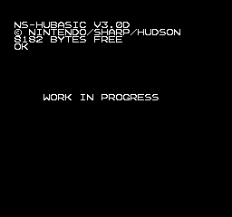

# [WIP] *Family BASIC V3 on Disk System*
https://github.com/NipponNoraneko/FC-DiskBASIC/tree/v3 から独立しました。<br>
今後はこのリポジトリを更新していきます。<br><br>
FC-BASICリポジトリの内容に以下の変更が加わっています。
- 許諾画面のスキップ<br>
- fdsファイルの作成に fdspackerを使用<br>

## Disk Systemで Family BASIC V3
  
### 追加機能
1. ディスクカードアクセス(実験中)<br>
現在はディスクカードへのload/saveはできません(load/saveの仕様を模索中)。
    - FDSLIST<br>
ディスクカードのファイル一覧を取得します(エラーチェックをしていないので危険です)<br>
※いろいろ未検証です。

2. 簡易モニタ(未完成)<BR>
メモリ内容の表示・変更を行います。<br>
  ■起動:　ダイレクトモードでMONと入力します。<br>
   MON<br>
     プロンプトが表示されます。<br>
        ]<br>
   ■メモリ内容の表示<br>
プロンプトが表示されている状態で'D'を入力します。<br>

## ビルド
### 準備
- [fdspacker](https://github.com/ClusterM/fdspacker): .fdsファイルの作成に使用します。
- [ca65,ld65(cc65スイート)](https://cc65.github.io/): アセンブラ、リンカ
- Family BASIC V3 と、その .nesファイル<br>
  ※"FamilyBasicV3.nes"として配置します。
### 作成
  以下のコマンドを入力します。
```
ca65 fbv3d.s -g --debug-info
ld65 -o fbv3d.bin -C fbv3d.cfg fbv3d.o
fdspacker pack fbv3d.json fbv3d.fds
```
### テスト/デバッグ環境
- [Mesen2](https://www.mesen.ca/)
## 謝辞
- 許諾画面スキップ<br>
  - Forum discussion:<br> https://forums.nesdev.org/viewtopic.php?t=25171
  - Github bbbradsmith/NES-ca65-example<br> https://github.com/bbbradsmith/NES-ca65-example/tree/fds

